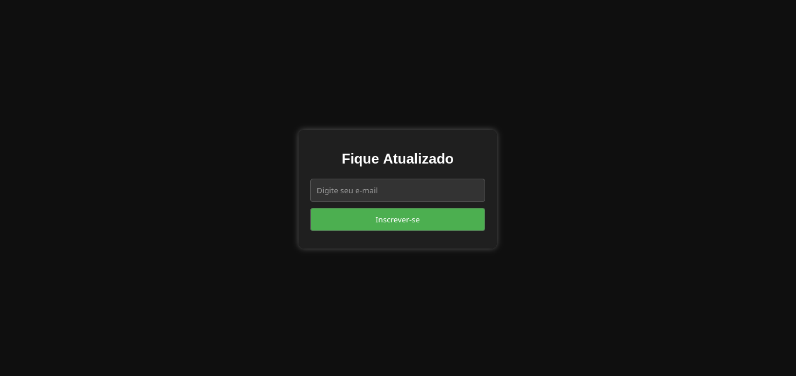

# Simple Email Collection Landing Page with Python and Flask




## Instalação: 
```code
python -m venv venv
make install
```


## Para rodar o projeto use:
```code
# Subindo os containers do postgres e mailcatcher
cd infra/
docker compose up -d
cd ..

# Crie as tabelas do banco com
flask init-db

gunicorn --config gunicorn_config.py app:app
```

## Rotas:

O aplicativo poderá ser acessado atraves da porta 8000 caso rode com o Gunicorn:
> Gunicorn: http://localhost:8000

> Caso use o servidor integrado ao flask: http://localhost:5000


### Mailcathcer:

Caso deseje você poderá acessar as os emails em ambiente de teste usando o emaicatcher.
> Caixa de Entrada: http://localhost:1080

